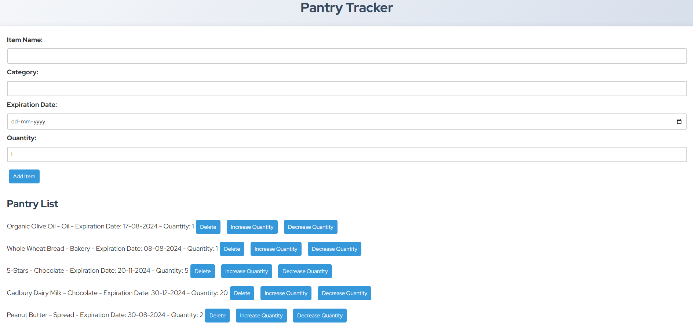
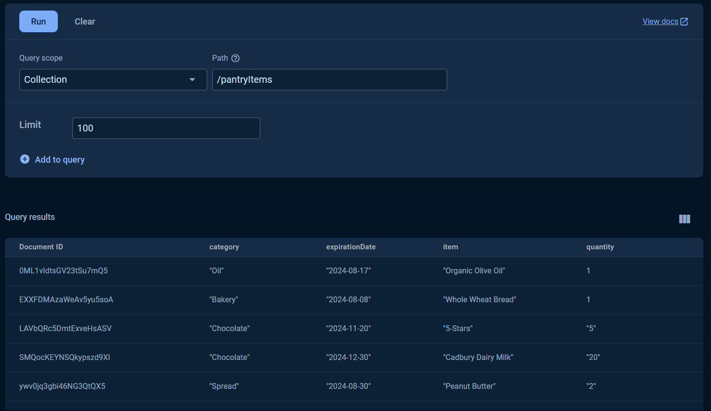

# Pantry Tracker



Pantry Tracker is a web application designed to help you manage your pantry efficiently. It allows you to track your pantry items, receive expiration alerts, manage your shopping list, and more. The project is built using React, Firebase for database management, and styled using CSS.

## Table of Contents

- [Features](#features)
- [Installation](#installation)
- [Usage](#usage)
- [File Structure](#file-structure)
- [Technologies Used](#technologies-used)
- [License](#license)

## Features

- **Pantry Item Management**: Add, edit, delete, and view pantry items.
- **Expiration Alerts**: Get notified about expired items and items about to expire.
- **Shopping List**: Manage your shopping list with ease; add and remove items as needed.
- **Real-time Updates**: Syncs in real-time with Firebase to keep your pantry data up-to-date.

## Installation

1. **Clone the repository**:
   ```bash
   git clone https://github.com/your-username/pantry-tracker.git
   cd pantry-tracker
   ```

2. **Install dependencies**:
   ```bash
   npm install
   ```

3. **Set up Firebase**:
   - Create a Firebase project in the [Firebase Console](https://console.firebase.google.com/).
   - Set up Firestore in your Firebase project.
   - Obtain your Firebase configuration and add it to `firebase.js`.

4. **Run the development server**:
   ```bash
   npm run dev
   ```

   Open [http://localhost:3000](http://localhost:3000) to view it in the browser.

## Usage

- **Add Items**: Use the form to add items to your pantry.
- **View Pantry**: Check the list of items in your pantry, along with expiration dates and quantities.
- **Manage Expiration Alerts**: See which items have expired or are about to expire.
- **Manage Shopping List**: Add items to your shopping list and manage them accordingly.

## File Structure

```
pantry-tracker/
├── .next/
├── components/
│   ├── ExpirationAlerts.js
│   ├── PantryForm.js
│   ├── PantryList.js
│   └── ShoppingList.js
├── node_modules/
├── pages/
│   ├── index.js
├── public/
├── styles/
│   ├── globals.css
│   └── Home.module.css
├── .gitignore
├── firebase.js
├── jsconfig.json
├── next.config.mjs
├── package.json
├── package-lock.json
└── README.md
```

## Technologies Used

- **Frontend**: React, Next.js
- **Database**: Firebase Firestore
- **Styling**: CSS


